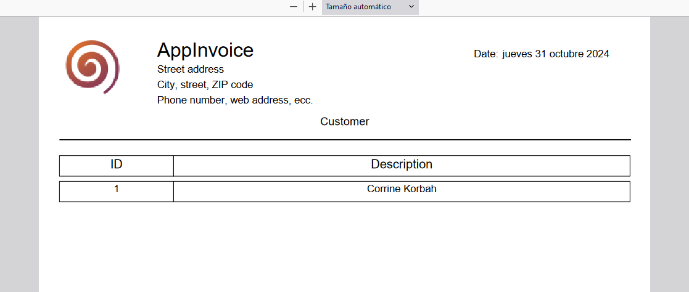

# AppInvoice

This project consists of the development of an Angular application that serves as the Frontend of a REST service with Spring Boot that implements Spring Security for security and authentication based on JWT Tokens. It simulates a very simple administrative application with a few very basic modules and fields in each of its entities.

The system has several modules:
- An Accounts Receivable module
- An accounts payable module
- A finance module
- An Inventory module

The application is not complete with all the administrative modules that must be present in an application of this type, the application is still under construction.

# Screenshots

